# Agentive Inversion: Life Management System Specification

**Version**: 1.1.0
**Last Updated**: 2026-01-18
**Status**: Active Development (Phases 1-3 Complete)

---

## Table of Contents

1. [Executive Summary](#1-executive-summary)
2. [Problem Statement](#2-problem-statement)
3. [System Overview](#3-system-overview)
4. [Architecture](#4-architecture)
5. [Data Model](#5-data-model)
6. [Email Integration](#6-email-integration)
7. [Calendar Integration](#7-calendar-integration)
8. [Agent Decision System](#8-agent-decision-system)
9. [User Interface](#9-user-interface)
10. [Chat Interface](#10-chat-interface)
11. [API Specification](#11-api-specification)
12. [Security & Privacy](#12-security--privacy)
13. [Implementation Phases](#13-implementation-phases)
14. [Open Questions](#14-open-questions)
15. [Glossary](#15-glossary)

---

## Current Implementation Status

> **Last Updated:** 2026-01-18

| Phase | Status | Key PRs |
|-------|--------|---------|
| Phase 1: Foundation | ✅ Complete | #9, #10, #11, #12 |
| Phase 2: Review Workflow | ✅ Complete | #41 |
| Phase 3: Rules Engine | ✅ Complete | #13, #16, #22 |
| Phase 4: Calendar Integration | 🚧 Not Started | Issue #26 |
| Phase 5: Chat Interface | 🔄 In Progress | PR #45 |
| Phase 6: Polish & Intelligence | 🚧 Not Started | - |
| Infrastructure & DevOps | ✅ Complete | #8, #14, #15, #42-44 |

**What Works Today:**
- Email polling from Gmail with OAuth2
- Agent analyzes emails and proposes decisions (create todo, ignore, archive)
- Users can approve/reject/edit decisions in the UI
- Rules engine for automatic decision-making
- Complete email parsing (To, CC, HTML body, labels, attachments)
- Docker deployment with single container
- Development environment via dev.sh

**Known Gaps:**
- Calendar poller not implemented (Issue #26)
- Deploy workflow is placeholder only (Issue #29)
- No production migration automation (Issue #32)
- Chat interface in progress (PR #45)

---

## 1. Executive Summary

Agentive Inversion is a personal life management system that consolidates emails, calendar events, and tasks into a single auditable interface. An AI agent processes incoming information and proposes actions, while maintaining full transparency about its reasoning. Users can review, approve, or reject agent decisions, and train the system over time through rules.

### Core Principles

1. **Single Pane of Glass**: All life inputs (email, calendar, manual tasks) visible in one place
2. **Auditable Decisions**: Every agent action is logged with reasoning and confidence
3. **Human-in-the-Loop**: Agent proposes, human approves (with progressive autonomy)
4. **Learnable**: User feedback creates rules that improve future automation
5. **Conversational Control**: Natural language chat interface for system interaction

---

## 2. Problem Statement

### Current Pain Points

1. **Information Fragmentation**: Actionable items scattered across email, calendar, notes, and memory
2. **Invisible Automation**: When automation exists, users don't know why decisions were made
3. **All-or-Nothing Trust**: Either fully manual or fully automated, no middle ground
4. **No Learning**: Systems don't improve based on user corrections
5. **Context Switching**: Managing life requires juggling multiple apps and interfaces

### User Stories

> "As a busy professional, I want all my actionable items in one place so I don't miss important tasks."

> "As someone skeptical of automation, I want to see WHY the system created a todo from an email so I can trust and correct it."

> "As a power user, I want to tell the system 'always do X for emails like this' so it learns my preferences."

> "As someone who thinks in conversation, I want to ask questions like 'what's urgent today?' and get intelligent answers."

---

## 3. System Overview


### High-Level Architecture


### Component Summary

| Component | Technology | Responsibility |
|-----------|------------|----------------|
| Backend Service | Rust + Axum + Tokio | Single service: REST API, pollers, agent, static files |
| Email Polling | Background task (tokio::spawn) | Fetch emails on interval, store in DB, trigger analysis |
| Calendar Polling | Background task (tokio::spawn) | Fetch events on interval, store in DB, trigger analysis |
| Agent Engine | In-process | Analyze items, propose actions, apply rules |
| Frontend | Rust + Yew (WASM) | Dashboard, chat interface, decision review |
| Database | PostgreSQL (Neon) | Persistent storage for all data |

**Key Design Decision:** All functionality runs in a single process. Email and calendar polling run as background tokio tasks within the same binary as the HTTP server. This simplifies deployment (one container, one process) and allows direct in-memory communication between components.

---

## 4. Architecture


### 4.1 Service Architecture

The backend runs as a single service combining HTTP handling with background polling tasks. All components share a database connection pool and can communicate through in-memory channels.


**Development Mode:**
- Backend serves API on port 3000
- Trunk dev server serves frontend on port 8080 (hot reload)
- Background tasks run within the backend process

**Production Mode:**
- Single Docker container runs the backend binary
- Frontend is pre-built and served as static files from the backend
- No separate processes needed


### 4.2 Data Flow

#### Email Processing Flow


#### Decision Lifecycle


### 4.3 Crate Dependencies

With pollers consolidated into the backend, the dependency graph simplifies:


**Note:** The `email-poller` and `calendar-poller` crates still exist as library code but are compiled into the backend binary rather than running as separate processes.

---

## 5. Data Model


### 5.1 Entity Relationship Diagram


### 5.2 Table Definitions

#### 5.2.1 `emails` (NEW)

Stores raw email data fetched from Gmail for processing and audit purposes.

| Column | Type | Nullable | Description |
|--------|------|----------|-------------|
| `id` | UUID | NO | Primary key |
| `account_id` | UUID | NO | FK to email_accounts |
| `gmail_id` | VARCHAR(255) | NO | Gmail message ID |
| `thread_id` | VARCHAR(255) | NO | Gmail thread ID |
| `history_id` | BIGINT | YES | Gmail history ID for sync |
| `subject` | TEXT | NO | Email subject line |
| `from_address` | VARCHAR(255) | NO | Sender email address |
| `from_name` | VARCHAR(255) | YES | Sender display name |
| `to_addresses` | TEXT[] | NO | Recipient addresses |
| `cc_addresses` | TEXT[] | YES | CC addresses |
| `snippet` | TEXT | YES | Gmail snippet preview |
| `body_text` | TEXT | YES | Plain text body |
| `body_html` | TEXT | YES | HTML body |
| `labels` | TEXT[] | YES | Gmail labels |
| `has_attachments` | BOOLEAN | NO | Whether email has attachments |
| `received_at` | TIMESTAMPTZ | NO | When email was received |
| `fetched_at` | TIMESTAMPTZ | NO | When we fetched it |
| `processed` | BOOLEAN | NO | Whether agent has analyzed it |
| `processed_at` | TIMESTAMPTZ | YES | When agent analyzed it |
| `archived_in_gmail` | BOOLEAN | NO | Whether archived in Gmail |

**Indexes:**
- `UNIQUE(account_id, gmail_id)`
- `idx_emails_processed` on `(processed, fetched_at)`
- `idx_emails_received` on `received_at DESC`
- `idx_emails_account` on `account_id`

#### 5.2.2 `calendar_events` (NEW)

Stores calendar events fetched from Google Calendar.

| Column | Type | Nullable | Description |
|--------|------|----------|-------------|
| `id` | UUID | NO | Primary key |
| `account_id` | UUID | NO | FK to calendar_accounts |
| `google_event_id` | VARCHAR(255) | NO | Google Calendar event ID |
| `ical_uid` | VARCHAR(255) | YES | iCal UID |
| `summary` | TEXT | YES | Event title |
| `description` | TEXT | YES | Event description |
| `location` | TEXT | YES | Event location |
| `start_time` | TIMESTAMPTZ | NO | Event start |
| `end_time` | TIMESTAMPTZ | NO | Event end |
| `all_day` | BOOLEAN | NO | Whether all-day event |
| `recurring` | BOOLEAN | NO | Whether recurring |
| `recurrence_rule` | TEXT | YES | RRULE string |
| `status` | VARCHAR(50) | NO | confirmed/tentative/cancelled |
| `organizer_email` | VARCHAR(255) | YES | Organizer email |
| `attendees` | JSONB | YES | Attendee list with status |
| `conference_link` | TEXT | YES | Video call URL |
| `fetched_at` | TIMESTAMPTZ | NO | When we fetched it |
| `processed` | BOOLEAN | NO | Whether agent analyzed it |
| `processed_at` | TIMESTAMPTZ | YES | When agent analyzed it |

**Indexes:**
- `UNIQUE(account_id, google_event_id)`
- `idx_calendar_events_time` on `(start_time, end_time)`
- `idx_calendar_events_processed` on `(processed, start_time)`

#### 5.2.3 `agent_decisions` (NEW)

Records every decision the agent makes, whether proposed or auto-applied.

| Column | Type | Nullable | Description |
|--------|------|----------|-------------|
| `id` | UUID | NO | Primary key |
| `source_type` | VARCHAR(50) | NO | 'email', 'calendar', 'manual' |
| `source_id` | UUID | NO | FK to emails/calendar_events |
| `source_external_id` | VARCHAR(255) | YES | Gmail ID / Google Event ID |
| `decision_type` | VARCHAR(50) | NO | See Decision Types below |
| `proposed_action` | JSONB | NO | Structured action data |
| `reasoning` | TEXT | NO | Human-readable explanation |
| `reasoning_details` | JSONB | YES | Structured reasoning data |
| `confidence` | REAL | NO | 0.0 to 1.0 |
| `status` | VARCHAR(50) | NO | See Status Types below |
| `applied_rule_id` | UUID | YES | FK to agent_rules if rule-matched |
| `result_todo_id` | UUID | YES | FK to todos if todo created |
| `user_feedback` | TEXT | YES | User's correction/comment |
| `created_at` | TIMESTAMPTZ | NO | When decision was made |
| `reviewed_at` | TIMESTAMPTZ | YES | When user reviewed |
| `executed_at` | TIMESTAMPTZ | YES | When action was executed |

**Decision Types:**
- `create_todo` - Create a new todo item
- `update_todo` - Modify existing todo
- `ignore` - No action needed
- `archive` - Archive in source system
- `defer` - Revisit later
- `categorize` - Assign to category
- `set_due_date` - Set/update due date

**Status Types:**
- `proposed` - Awaiting user review
- `approved` - User approved, pending execution
- `rejected` - User rejected
- `auto_approved` - Rule matched, auto-executed
- `executed` - Action completed
- `failed` - Execution failed

**Indexes:**
- `idx_decisions_status` on `(status, created_at)`
- `idx_decisions_source` on `(source_type, source_id)`
- `idx_decisions_rule` on `applied_rule_id`

#### 5.2.4 `agent_rules` (NEW)

User-created rules for automatic decision-making.

| Column | Type | Nullable | Description |
|--------|------|----------|-------------|
| `id` | UUID | NO | Primary key |
| `name` | VARCHAR(255) | NO | Human-readable rule name |
| `description` | TEXT | YES | What this rule does |
| `source_type` | VARCHAR(50) | NO | 'email', 'calendar', 'any' |
| `rule_type` | VARCHAR(50) | NO | See Rule Types below |
| `conditions` | JSONB | NO | Match conditions |
| `action` | VARCHAR(50) | NO | Action to take |
| `action_params` | JSONB | YES | Action parameters |
| `priority` | INTEGER | NO | Higher = evaluated first |
| `is_active` | BOOLEAN | NO | Whether rule is enabled |
| `created_from_decision_id` | UUID | YES | FK if created from decision |
| `match_count` | INTEGER | NO | Times this rule matched |
| `last_matched_at` | TIMESTAMPTZ | YES | Last match timestamp |
| `created_at` | TIMESTAMPTZ | NO | When rule was created |
| `updated_at` | TIMESTAMPTZ | NO | Last modification |

**Rule Types:**
- `exact_match` - Exact field matching
- `contains` - Substring matching
- `regex` - Regular expression
- `sender` - Match sender address/domain
- `label` - Match Gmail labels
- `time_based` - Based on time/date

**Condition Schema (JSONB):**
```json
{
  "operator": "AND|OR",
  "clauses": [
    {
      "field": "from_address|subject|body|labels|...",
      "matcher": "equals|contains|regex|starts_with|ends_with",
      "value": "string or pattern",
      "case_sensitive": false
    }
  ]
}
```

**Indexes:**
- `idx_rules_active` on `(is_active, priority DESC)`
- `idx_rules_source` on `source_type`

#### 5.2.5 `todos` (MODIFIED)

Add fields to support richer source tracking.

| Column | Type | Nullable | Description |
|--------|------|----------|-------------|
| ... | ... | ... | (existing columns) |
| `decision_id` | UUID | YES | FK to agent_decisions |
| `priority` | VARCHAR(20) | YES | 'low', 'medium', 'high', 'urgent' |
| `tags` | TEXT[] | YES | User-defined tags |
| `recurring_rule` | TEXT | YES | Recurrence pattern |
| `parent_todo_id` | UUID | YES | FK for subtasks |
| `archived` | BOOLEAN | NO | Soft delete |
| `archived_at` | TIMESTAMPTZ | YES | When archived |

#### 5.2.6 `chat_messages` (NEW)

Stores chat conversation history.

| Column | Type | Nullable | Description |
|--------|------|----------|-------------|
| `id` | UUID | NO | Primary key |
| `session_id` | UUID | NO | Conversation session ID |
| `role` | VARCHAR(20) | NO | 'user' or 'assistant' |
| `content` | TEXT | NO | Message content |
| `parsed_intent` | JSONB | YES | Structured intent if parsed |
| `executed_actions` | JSONB | YES | Actions taken in response |
| `created_at` | TIMESTAMPTZ | NO | Message timestamp |

**Indexes:**
- `idx_chat_session` on `(session_id, created_at)`

#### 5.2.7 `email_accounts` (MODIFIED)

Add fields for enhanced sync tracking.

| Column | Type | Nullable | Description |
|--------|------|----------|-------------|
| ... | ... | ... | (existing columns) |
| `last_history_id` | BIGINT | YES | Gmail history ID for incremental sync |
| `full_sync_completed` | BOOLEAN | NO | Whether initial sync done |
| `emails_synced_count` | INTEGER | NO | Total emails fetched |
| `sync_errors_count` | INTEGER | NO | Consecutive sync errors |

#### 5.2.8 `calendar_accounts` (MODIFIED)

Add OAuth and sync tracking fields.

| Column | Type | Nullable | Description |
|--------|------|----------|-------------|
| ... | ... | ... | (existing columns) |
| `email_address` | VARCHAR(255) | NO | Account email |
| `oauth_refresh_token` | TEXT | YES | OAuth refresh token |
| `oauth_access_token` | TEXT | YES | Current access token |
| `oauth_token_expires_at` | TIMESTAMPTZ | YES | Token expiration |
| `sync_token` | TEXT | YES | Calendar sync token |
| `sync_status` | VARCHAR(50) | NO | Sync state |
| `last_sync_error` | TEXT | YES | Last error message |
| `is_active` | BOOLEAN | NO | Whether enabled |

---

## 6. Email Integration


### 6.1 Email Processing Pipeline


### 6.2 Agent Analysis Logic

The agent analyzes each email through multiple layers:

#### Layer 1: Rule Matching (Fast Path)

```rust
fn check_rules(email: &Email) -> Option<AgentDecision> {
    let rules = get_active_rules_by_priority();

    for rule in rules {
        if rule.matches(email) {
            return Some(AgentDecision {
                decision_type: rule.action,
                reasoning: format!("Matched rule: {}", rule.name),
                confidence: 1.0,
                status: DecisionStatus::AutoApproved,
                applied_rule_id: Some(rule.id),
            });
        }
    }
    None
}
```

#### Layer 2: Heuristic Analysis

```rust
struct HeuristicSignals {
    has_action_keywords: bool,      // "action required", "please review", etc.
    has_deadline_mention: bool,     // dates, "by EOD", "ASAP"
    is_from_known_sender: bool,     // previous interactions
    is_reply_in_thread: bool,       // ongoing conversation
    has_question: bool,             // needs response
    is_automated: bool,             // newsletters, notifications
    urgency_indicators: Vec<String>,
}

fn analyze_heuristics(email: &Email) -> HeuristicSignals {
    // Keyword detection
    // Date parsing
    // Sender analysis
    // Thread analysis
}
```

**Keyword Categories:**

| Category | Keywords | Weight |
|----------|----------|--------|
| Action Required | "action required", "action needed", "please review", "needs your", "awaiting your" | High |
| Urgency | "urgent", "asap", "immediately", "time sensitive", "deadline" | High |
| Request | "could you", "can you", "would you", "please", "request" | Medium |
| FYI Only | "fyi", "no action needed", "for your information", "no response needed" | Negative |
| Automated | "noreply", "do-not-reply", "automated", "notification" | Negative |

#### Layer 3: LLM Analysis (Optional)

For emails that don't match rules and have ambiguous heuristics:

```rust
struct LLMAnalysisRequest {
    email_subject: String,
    email_body_preview: String,  // First 500 chars
    sender: String,
    context: EmailContext,       // Thread info, sender history
}

struct LLMAnalysisResponse {
    is_actionable: bool,
    suggested_action: ActionType,
    suggested_todo_title: Option<String>,
    suggested_due_date: Option<DateTime>,
    confidence: f32,
    reasoning: String,
}
```

**LLM Prompt Template:**

```
Analyze this email and determine if it requires action from the recipient.

Subject: {subject}
From: {sender}
Preview: {body_preview}

Previous emails from this sender: {sender_history}
Thread context: {thread_info}

Respond with:
1. Is this actionable? (yes/no)
2. If yes, what action? (create_todo/respond/archive/defer)
3. Suggested todo title (if applicable)
4. Detected due date (if any)
5. Confidence (0.0-1.0)
6. Brief reasoning (1-2 sentences)
```

### 6.3 Decision Reasoning Format

Every decision includes human-readable reasoning:

```json
{
  "id": "uuid",
  "source_type": "email",
  "source_id": "email-uuid",
  "decision_type": "create_todo",
  "proposed_action": {
    "todo_title": "Review Q4 budget proposal",
    "todo_description": "From: alice@company.com\nAction items mentioned in email",
    "due_date": "2026-01-25T17:00:00Z",
    "category": "work"
  },
  "reasoning": "Email contains 'please review' and mentions deadline 'by end of next week'. Sender is a frequent contact with 15 previous emails.",
  "reasoning_details": {
    "matched_keywords": ["please review"],
    "detected_deadline": "end of next week",
    "sender_frequency": 15,
    "thread_length": 3,
    "heuristic_score": 0.82
  },
  "confidence": 0.85,
  "status": "proposed"
}
```


### 6.4 Gmail Archive Flow


---

## 7. Calendar Integration


### 7.1 Calendar Event Processing


### 7.2 Calendar Event Analysis Signals

| Signal | Detection Method | Action |
|--------|------------------|--------|
| Prep work mentioned | Keywords: "prepare", "review before", "bring" | Create todo with due before meeting |
| Deadline event | All-day event with "deadline", "due" in title | Create todo with that due date |
| Recurring meeting | Has RRULE | Consider recurring todo |
| Declined event | attendee.responseStatus = "declined" | Ignore |
| Cancelled event | status = "cancelled" | Remove related todos |

### 7.3 Calendar-Todo Sync


---

## 8. Agent Decision System


### 8.1 Confidence Scoring

**Base Score Components:**

| Component | Weight |
|-----------|--------|
| Rule match | 1.0 (automatic full confidence) |
| Strong keywords | +0.3 per keyword (max 0.6) |
| Deadline detected | +0.2 |
| Known sender | +0.1 |
| Reply in thread | +0.1 |
| Automated sender | -0.3 |
| FYI keywords | -0.2 |
| LLM agreement | +0.2 if LLM confirms heuristic |

**Confidence Thresholds:**

| Confidence Range | Behavior |
|------------------|----------|
| 0.9 - 1.0 | Auto-approve (if user enables) |
| 0.7 - 0.9 | Propose with high confidence indicator |
| 0.5 - 0.7 | Propose with medium confidence |
| 0.3 - 0.5 | Propose with low confidence, suggest skip |
| 0.0 - 0.3 | Auto-ignore (don't surface to user) |

### 8.2 Rule System

#### Rule Creation Flow

**Option 1: From Decision Approval**

```mermaid
flowchart TB
    approve["User approves decision"] --> ask{"Always do this for<br/>similar items?"}
    ask --> |Yes| suggest["Suggest rule based on:<br/>• Same sender?<br/>• Same subject pattern?<br/>• Same labels?"]
    suggest --> confirm["User confirms/edits conditions"]
    confirm --> save["Rule saved and activated"]
    ask --> |No| done["Done"]
```



**Option 2: Manual Rule Creation**

```mermaid
flowchart TB
    nav["User navigates to Rules settings"] --> new["New Rule button"]
    new --> builder["Rule Builder UI:<br/>• Source type<br/>• Conditions<br/>• Action<br/>• Priority"]
    builder --> test["Test against recent items (preview)"]
    test --> activate["Save and activate"]
```



#### Example Rules

**Rule: Auto-archive newsletters**
```json
{
  "name": "Auto-archive newsletters",
  "source_type": "email",
  "conditions": {
    "operator": "OR",
    "clauses": [
      {"field": "from_address", "matcher": "contains", "value": "newsletter"},
      {"field": "from_address", "matcher": "contains", "value": "noreply"},
      {"field": "labels", "matcher": "contains", "value": "CATEGORY_PROMOTIONS"}
    ]
  },
  "action": "archive",
  "priority": 100
}
```

**Rule: Always create todo from boss**
```json
{
  "name": "Boss emails are always actionable",
  "source_type": "email",
  "conditions": {
    "operator": "AND",
    "clauses": [
      {"field": "from_address", "matcher": "equals", "value": "boss@company.com"}
    ]
  },
  "action": "create_todo",
  "action_params": {
    "category": "work",
    "priority": "high"
  },
  "priority": 200
}
```

### 8.3 Learning from Feedback

```mermaid
flowchart TB
    reject["User rejects a decision"] --> why["Why was this incorrect?<br/>• Not actionable<br/>• Wrong action type<br/>• Wrong category<br/>• Other"]
    why --> store["Store feedback with decision record"]
    store --> analyze["Analyze rejection patterns:<br/>• Same sender?<br/>• Same keywords?<br/>• Same time of day?"]
    analyze --> suggest["Suggest rule to prevent<br/>future false positives"]
```



---

## 9. User Interface

### 9.1 Layout Structure

```
┌─────────────────────────────────────────────────────────────────────────┐
│  ┌─────┐  Agentive Inversion                    [Search]  [⚙️]  [👤]   │
│  │ ≡   │                                                                │
├──┴─────┴────────────────────────────────────────────────────────────────┤
│                                                                          │
│  ┌──────────────┐  ┌────────────────────────────────┐  ┌──────────────┐ │
│  │              │  │                                │  │              │ │
│  │   SIDEBAR    │  │         MAIN CONTENT           │  │   DETAILS    │ │
│  │              │  │                                │  │              │ │
│  │  Navigation  │  │   List view or Chat view       │  │  Selected    │ │
│  │  & Filters   │  │                                │  │  item info   │ │
│  │              │  │                                │  │              │ │
│  │  200px       │  │   Flexible                     │  │  300px       │ │
│  │              │  │                                │  │              │ │
│  └──────────────┘  └────────────────────────────────┘  └──────────────┘ │
│                                                                          │
└─────────────────────────────────────────────────────────────────────────┘
```

### 9.2 Sidebar Navigation

```
┌──────────────────────┐
│  📥 Inbox        (5) │  ← Items needing review
│  ├─ Needs Review (3) │
│  ├─ Auto-Processed   │
│  └─ All Items        │
├──────────────────────┤
│  ✅ Todos       (12) │
│  ├─ Today        (4) │
│  ├─ This Week    (6) │
│  ├─ Someday      (2) │
│  └─ Completed        │
├──────────────────────┤
│  📅 Calendar         │
│  ├─ Today            │
│  ├─ This Week        │
│  └─ Upcoming         │
├──────────────────────┤
│  💬 Chat             │  ← Conversational interface
├──────────────────────┤
│  📊 Decision Log     │  ← Audit trail
├──────────────────────┤
│  ⚙️ Settings         │
│  ├─ Accounts         │
│  ├─ Rules            │
│  └─ Preferences      │
└──────────────────────┘
```

### 9.3 Inbox View (Needs Review)

```
┌─────────────────────────────────────────────────────────────────────────┐
│  Needs Review (3 items)                              [Mark All Read] ▾  │
├─────────────────────────────────────────────────────────────────────────┤
│                                                                          │
│  ┌───────────────────────────────────────────────────────────────────┐  │
│  │ 📧  Q4 Budget Review                              2 hours ago     │  │
│  │     From: alice@company.com                                       │  │
│  │     ┌─────────────────────────────────────────────────────────┐   │  │
│  │     │ 🤖 Agent suggests: Create todo                          │   │  │
│  │     │    "Review Q4 budget proposal"                          │   │  │
│  │     │    Due: Jan 25 (detected from email)                    │   │  │
│  │     │    Confidence: 85%                                      │   │  │
│  │     │    Reason: Contains "please review" + deadline mention  │   │  │
│  │     └─────────────────────────────────────────────────────────┘   │  │
│  │     [✓ Approve] [✗ Reject] [✏️ Edit] [📌 Always do this]         │  │
│  └───────────────────────────────────────────────────────────────────┘  │
│                                                                          │
│  ┌───────────────────────────────────────────────────────────────────┐  │
│  │ 📅  Team Standup (Tomorrow 9am)                   Calendar event  │  │
│  │     ┌─────────────────────────────────────────────────────────┐   │  │
│  │     │ 🤖 Agent suggests: Ignore                               │   │  │
│  │     │    Recurring meeting, no action items detected          │   │  │
│  │     │    Confidence: 92%                                      │   │  │
│  │     └─────────────────────────────────────────────────────────┘   │  │
│  │     [✓ Confirm] [✗ Actually needs todo]                           │  │
│  └───────────────────────────────────────────────────────────────────┘  │
│                                                                          │
│  ┌───────────────────────────────────────────────────────────────────┐  │
│  │ 📧  RE: Project timeline                          5 hours ago     │  │
│  │     From: bob@vendor.com                                          │  │
│  │     ┌─────────────────────────────────────────────────────────┐   │  │
│  │     │ 🤖 Agent suggests: Create todo                          │   │  │
│  │     │    "Respond to Bob about project timeline"              │   │  │
│  │     │    Confidence: 62% (medium)                             │   │  │
│  │     │    Reason: Question mark detected, awaiting response    │   │  │
│  │     └─────────────────────────────────────────────────────────┘   │  │
│  │     [✓ Approve] [✗ Reject] [✏️ Edit] [📌 Always do this]         │  │
│  └───────────────────────────────────────────────────────────────────┘  │
│                                                                          │
└─────────────────────────────────────────────────────────────────────────┘
```

### 9.4 Details Panel (When Item Selected)

```
┌──────────────────────────┐
│  📧 Q4 Budget Review     │
├──────────────────────────┤
│                          │
│  From: alice@company.com │
│  Date: Jan 18, 10:32 AM  │
│  Thread: 3 messages      │
│                          │
├──────────────────────────┤
│  Subject:                │
│  Q4 Budget Review        │
│                          │
│  Body Preview:           │
│  Hi, please review the   │
│  attached Q4 budget      │
│  proposal by end of next │
│  week. Let me know if    │
│  you have questions...   │
│                          │
│  [View Full Email]       │
│                          │
├──────────────────────────┤
│  🤖 Agent Analysis       │
├──────────────────────────┤
│                          │
│  Decision: Create Todo   │
│  Confidence: 85%         │
│                          │
│  Reasoning:              │
│  • "please review" found │
│  • Deadline: "end of     │
│    next week" → Jan 25   │
│  • Sender: 15 previous   │
│    emails (known)        │
│  • Thread: Active (last  │
│    reply 2 days ago)     │
│                          │
│  Keywords matched:       │
│  [please review] [budget]│
│                          │
├──────────────────────────┤
│  Proposed Todo:          │
├─���────────────────────────┤
│  Title:                  │
│  ┌────────────────────┐  │
│  │Review Q4 budget    │  │
│  │proposal            │  │
│  └────────────────────┘  │
│                          │
│  Due Date:               │
│  ┌────────────────────┐  │
│  │ Jan 25, 2026  📅   │  │
│  └────────────────────┘  │
│                          │
│  Category:               │
│  ┌────────────────────┐  │
│  │ Work           ▾   │  │
│  └────────────────────┘  │
│                          │
│  ☐ Archive email after   │
│    creating todo         │
│                          │
│  ☐ Always do this for    │
│    emails from Alice     │
│                          │
├──────────────────────────┤
│  [✓ Approve] [✗ Reject]  │
└──────────────────────────┘
```

### 9.5 Decision Log View

```
┌─────────────────────────────────────────────────────────────────────────┐
│  Decision Log                                    [Filter ▾] [Export]    │
├─────────────────────────────────────────────────────────────────────────┤
│                                                                          │
│  Today                                                                   │
│  ──────                                                                  │
│                                                                          │
│  ┌─────────────────────────────────────────────────────────────────┐    │
│  │ ✓ AUTO   📧 Newsletter from TechCrunch           10:45 AM      │    │
│  │          Action: Archive                                        │    │
│  │          Rule: "Auto-archive newsletters"                       │    │
│  └─────────────────────────────────────────────────────────────────┘    │
│                                                                          │
│  ┌─────────────────────────────────────────────────────────────────┐    │
│  │ ✓ APPROVED 📧 Q4 Budget Review                    10:32 AM     │    │
│  │            Action: Created todo "Review Q4 budget proposal"     │    │
│  │            Reviewed: 10:35 AM (3 min later)                     │    │
│  └─────────────────────────────────────────────────────────────────┘    │
│                                                                          │
│  ┌─────────────────────────────────────────────────────────────────┐    │
│  │ ✗ REJECTED 📧 Meeting notes from sync              9:15 AM     │    │
│  │            Proposed: Create todo                                │    │
│  │            Feedback: "These are just notes, not actionable"     │    │
│  └─────────────────────────────────────────────────────────────────┘    │
│                                                                          │
│  ┌─────────────────────────────────────────────────────────────────┐    │
│  │ ○ IGNORED  📧 AWS billing notification             8:00 AM      │    │
│  │            Confidence too low (0.15)                            │    │
│  │            Reason: Automated sender, no action keywords         │    │
│  └─────────────────────────────────────────────────────────────────┘    │
│                                                                          │
│  Yesterday                                                               │
│  ─────────                                                               │
│  ... (more entries)                                                      │
│                                                                          │
└─────────────────────────────────────────────────────────────────────────┘
```

### 9.6 Rules Management View

```
┌─────────────────────────────────────────────────────────────────────────┐
│  Rules                                                  [+ New Rule]    │
├─────────────────────────────────────────────────────────────────────────┤
│                                                                          │
│  Active Rules (4)                                                        │
│  ────────────────                                                        │
│                                                                          │
│  ┌─────────────────────────────────────────────────────────────────┐    │
│  │ 🟢 Auto-archive newsletters                      Priority: 100  │    │
│  │    Source: Email                                                │    │
│  │    Condition: from contains "newsletter" OR "noreply"           │    │
│  │    Action: Archive                                              │    │
│  │    Matched: 47 times | Last: 2 hours ago                        │    │
│  │    [Edit] [Disable] [Delete]                                    │    │
│  └─────────────────────────────────────────────────────────────────┘    │
│                                                                          │
│  ┌─────────────────────────────────────────────────────────────────┐    │
│  │ 🟢 Boss emails are actionable                    Priority: 200  │    │
│  │    Source: Email                                                │    │
│  │    Condition: from equals "boss@company.com"                    │    │
│  │    Action: Create todo (category: work, priority: high)         │    │
│  │    Matched: 8 times | Last: 1 day ago                           │    │
│  │    [Edit] [Disable] [Delete]                                    │    │
│  └─────────────────────────────────────────────────────────────────┘    │
│                                                                          │
│  ┌─────────────────────────────────────────────────────────────────┐    │
│  │ 🟢 Project X always needs todo                   Priority: 150  │    │
│  │    Source: Email                                                │    │
│  │    Condition: subject contains "Project X"                      │    │
│  │    Action: Create todo (category: projects)                     │    │
│  │    Matched: 12 times | Last: 3 hours ago                        │    │
│  │    [Edit] [Disable] [Delete]                                    │    │
│  └─────────────────────────────────────────────────────────────────┘    │
│                                                                          │
│  Disabled Rules (1)                                                      │
│  ─────────────────                                                       │
│                                                                          │
│  ┌─────────────────────────────────────────────────────────────────┐    │
│  │ 🔴 Old project rule                              Priority: 50   │    │
│  │    [Enable] [Delete]                                            │    │
│  └─────────────────────────────────────────────────────────────────┘    │
│                                                                          │
└─────────────────────────────────────────────────────────────────────────┘
```

---

## 10. Chat Interface

### 10.1 Chat View Layout

```
┌─────────────────────────────────────────────────────────────────────────┐
│  💬 Chat                                              [Clear] [Export]  │
├─────────────────────────────────────────────────────────────────────────┤
│                                                                          │
│  ┌─────────────────────────────────────────────────────────────────┐    │
│  │                                                                  │    │
│  │  You: What emails came in today?                    10:30 AM    │    │
│  │                                                                  │    │
│  │  ─────────────────────────────────────────────────────────────  │    │
│  │                                                                  │    │
│  │  Agent: You received 12 emails today. Here's the summary:       │    │
│  │                                                                  │    │
│  │  📧 Actionable (3):                                             │    │
│  │    1. Q4 Budget Review - from alice@company.com                 │    │
│  │       → Proposed todo: "Review Q4 budget proposal"              │    │
│  │    2. Project timeline question - from bob@vendor.com           │    │
│  │       → Proposed todo: "Respond to Bob"                         │    │
│  │    3. Meeting prep - from calendar                              │    │
│  │       → Proposed todo: "Prepare for client call"                │    │
│  │                                                                  │    │
│  │  📰 Auto-archived (7): Newsletters, promotions                  │    │
│  │                                                                  │    │
│  │  ⏸️ Ignored (2): Low confidence, likely FYI only                │    │
│  │                                                                  │    │
│  │  Would you like me to show details for any of these?            │    │
│  │                                                                  │    │
│  │  ─────────────────────────────────────────────────────────────  │    │
│  │                                                                  │    │
│  │  You: Show me #1                                    10:31 AM    │    │
│  │                                                                  │    │
│  │  ─────────────────────────────────────────────────────────────  │    │
│  │                                                                  │    │
│  │  Agent: Here's the Q4 Budget Review email:                      │    │
│  │                                                                  │    │
│  │  ┌─────────────────────────────────────────────────────────┐   │    │
│  │  │ From: alice@company.com                                  │   │    │
│  │  │ Subject: Q4 Budget Review                                │   │    │
│  │  │ Received: Today 10:32 AM                                 │   │    │
│  │  │                                                          │   │    │
│  │  │ Hi, please review the attached Q4 budget proposal by     │   │    │
│  │  │ end of next week. Let me know if you have questions.     │   │    │
│  │  └─────────────────────────────────────────────────────────┘   │    │
│  │                                                                  │    │
│  │  My analysis:                                                   │    │
│  │  • Confidence: 85%                                              │    │
│  │  • Detected "please review" + deadline "end of next week"       │    │
│  │  • Proposed due date: Jan 25                                    │    │
│  │                                                                  │    │
│  │  [Approve Todo] [Reject] [Edit & Approve]                       │    │
│  │                                                                  │    │
│  └─────────────────────────────────────────────────────────────────┘    │
│                                                                          │
├─────────────────────────────────────────────────────────────────────────┤
│  ┌─────────────────────────────────────────────────────────────────┐    │
│  │ Type a message...                                         [Send]│    │
│  └─────────────────────────────────────────────────────────────────┘    │
│                                                                          │
│  Quick actions: [📧 Today's emails] [✅ Open todos] [📅 This week]      │
└─────────────────────────────────────────────────────────────────────────┘
```

### 10.2 Supported Chat Commands

| Intent | Example Phrases | Action |
|--------|-----------------|--------|
| **Email queries** | "What emails came in today?", "Show unread emails", "Emails from Alice" | List/filter emails |
| **Todo queries** | "What's on my todo list?", "Show urgent tasks", "What's due this week?" | List/filter todos |
| **Calendar queries** | "What meetings do I have today?", "Show tomorrow's schedule" | List calendar events |
| **Approve actions** | "Approve all", "Approve #1", "Yes, create that todo" | Execute proposed decisions |
| **Reject actions** | "Reject #2", "No, ignore that", "That's not actionable" | Reject proposed decisions |
| **Create todos** | "Add todo: Call dentist", "Remind me to...", "I need to..." | Create manual todo |
| **Modify todos** | "Mark X as done", "Change due date to Friday", "Delete the dentist todo" | Update todos |
| **Create rules** | "Always archive emails from X", "Never create todos for newsletters" | Create rules |
| **Explain decisions** | "Why did you create this todo?", "What rule matched?" | Show decision reasoning |
| **Status queries** | "How many decisions today?", "Show my rules", "Sync status?" | System status |

### 10.3 Natural Language Processing

The chat handler uses a combination of:

1. **Pattern matching** for common commands
2. **Intent classification** for ambiguous inputs
3. **Entity extraction** for dates, email addresses, todo titles
4. **Context awareness** for follow-up questions

```rust
enum ChatIntent {
    ListEmails { filter: EmailFilter },
    ListTodos { filter: TodoFilter },
    ListCalendarEvents { filter: CalendarFilter },
    ApproveDecision { decision_id: Option<Uuid>, selector: Option<String> },
    RejectDecision { decision_id: Option<Uuid>, feedback: Option<String> },
    CreateTodo { title: String, due_date: Option<DateTime>, category: Option<String> },
    UpdateTodo { todo_id: Uuid, updates: TodoUpdates },
    CreateRule { conditions: RuleConditions, action: RuleAction },
    ExplainDecision { decision_id: Uuid },
    SystemStatus,
    Help,
    Unknown { raw_input: String },
}
```

### 10.4 Chat Response Format

Responses are structured for both display and action:

```rust
struct ChatResponse {
    message: String,                    // Human-readable response
    structured_data: Option<Value>,     // JSON data for UI rendering
    suggested_actions: Vec<ChatAction>, // Buttons/quick actions
    requires_confirmation: bool,        // Wait for user confirmation?
}

struct ChatAction {
    label: String,
    action_type: ActionType,
    params: Value,
}
```

---

## 11. API Specification

### 11.1 REST Endpoints

#### Emails

| Method | Endpoint | Description |
|--------|----------|-------------|
| GET | `/api/emails` | List emails with filters |
| GET | `/api/emails/:id` | Get email details |
| POST | `/api/emails/:id/archive` | Archive email in Gmail |
| GET | `/api/emails/stats` | Email statistics |

**GET /api/emails Query Parameters:**
- `account_id` - Filter by email account
- `processed` - Filter by processed status (true/false)
- `from` - Filter by sender (partial match)
- `subject` - Filter by subject (partial match)
- `since` - Emails received after this datetime
- `until` - Emails received before this datetime
- `limit` - Max results (default: 50)
- `offset` - Pagination offset

#### Decisions

| Method | Endpoint | Description |
|--------|----------|-------------|
| GET | `/api/decisions` | List decisions with filters |
| GET | `/api/decisions/:id` | Get decision details |
| POST | `/api/decisions/:id/approve` | Approve a decision |
| POST | `/api/decisions/:id/reject` | Reject a decision |
| GET | `/api/decisions/pending` | Get pending decisions |
| GET | `/api/decisions/stats` | Decision statistics |

**POST /api/decisions/:id/approve Body:**
```json
{
  "modifications": {
    "todo_title": "Modified title",
    "due_date": "2026-01-25T17:00:00Z",
    "category_id": "uuid"
  },
  "create_rule": true,
  "rule_name": "Always create todo for emails from Alice"
}
```

**POST /api/decisions/:id/reject Body:**
```json
{
  "feedback": "This is not actionable, just FYI",
  "create_rule": true,
  "rule_action": "ignore"
}
```

#### Rules

| Method | Endpoint | Description |
|--------|----------|-------------|
| GET | `/api/rules` | List all rules |
| GET | `/api/rules/:id` | Get rule details |
| POST | `/api/rules` | Create new rule |
| PUT | `/api/rules/:id` | Update rule |
| DELETE | `/api/rules/:id` | Delete rule |
| POST | `/api/rules/:id/toggle` | Enable/disable rule |
| POST | `/api/rules/test` | Test rule against recent items |

**POST /api/rules Body:**
```json
{
  "name": "Auto-archive newsletters",
  "description": "Automatically archive all newsletter emails",
  "source_type": "email",
  "conditions": {
    "operator": "OR",
    "clauses": [
      {"field": "from_address", "matcher": "contains", "value": "newsletter"},
      {"field": "labels", "matcher": "contains", "value": "CATEGORY_PROMOTIONS"}
    ]
  },
  "action": "archive",
  "priority": 100
}
```

#### Chat

| Method | Endpoint | Description |
|--------|----------|-------------|
| POST | `/api/chat` | Send chat message |
| GET | `/api/chat/history` | Get chat history |
| DELETE | `/api/chat/history` | Clear chat history |

**POST /api/chat Body:**
```json
{
  "message": "What emails came in today?",
  "session_id": "uuid"
}
```

**POST /api/chat Response:**
```json
{
  "message": "You received 12 emails today...",
  "structured_data": {
    "emails": [...],
    "summary": {...}
  },
  "suggested_actions": [
    {"label": "Show details", "action": "show_email", "params": {"id": "..."}}
  ]
}
```

#### Todos (Extended)

| Method | Endpoint | Description |
|--------|----------|-------------|
| GET | `/api/todos` | List todos (existing) |
| POST | `/api/todos` | Create todo (existing) |
| PUT | `/api/todos/:id` | Update todo (existing) |
| DELETE | `/api/todos/:id` | Delete todo (existing) |
| POST | `/api/todos/:id/complete` | Mark complete |
| POST | `/api/todos/:id/uncomplete` | Mark incomplete |
| GET | `/api/todos/today` | Today's todos |
| GET | `/api/todos/overdue` | Overdue todos |

#### Calendar Events

| Method | Endpoint | Description |
|--------|----------|-------------|
| GET | `/api/calendar-events` | List events with filters |
| GET | `/api/calendar-events/:id` | Get event details |
| GET | `/api/calendar-events/today` | Today's events |
| GET | `/api/calendar-events/week` | This week's events |

#### Accounts

| Method | Endpoint | Description |
|--------|----------|-------------|
| GET | `/api/email-accounts` | List email accounts (existing) |
| POST | `/api/email-accounts` | Start OAuth (existing) |
| DELETE | `/api/email-accounts/:id` | Delete account (existing) |
| POST | `/api/email-accounts/:id/sync` | Trigger manual sync |
| GET | `/api/calendar-accounts` | List calendar accounts |
| POST | `/api/calendar-accounts` | Start calendar OAuth |
| DELETE | `/api/calendar-accounts/:id` | Delete calendar account |

### 11.2 WebSocket API

**Endpoint:** `ws://localhost:3000/ws`

**Events (Server → Client):**

```json
// New email received
{
  "type": "email_received",
  "data": {
    "email_id": "uuid",
    "subject": "...",
    "from": "...",
    "preview": "..."
  }
}

// New decision proposed
{
  "type": "decision_proposed",
  "data": {
    "decision_id": "uuid",
    "source_type": "email",
    "decision_type": "create_todo",
    "confidence": 0.85
  }
}

// Decision executed
{
  "type": "decision_executed",
  "data": {
    "decision_id": "uuid",
    "result_todo_id": "uuid"
  }
}

// Sync status update
{
  "type": "sync_status",
  "data": {
    "account_id": "uuid",
    "status": "syncing",
    "progress": 0.5
  }
}
```

**Events (Client → Server):**

```json
// Subscribe to updates
{
  "type": "subscribe",
  "channels": ["emails", "decisions", "todos"]
}

// Quick action
{
  "type": "quick_action",
  "action": "approve_decision",
  "params": {
    "decision_id": "uuid"
  }
}
```

---

## 12. Security & Privacy

### 12.1 Data Protection

| Data Type | Storage | Encryption | Retention |
|-----------|---------|------------|-----------|
| OAuth tokens | PostgreSQL | At-rest encryption | Until revoked |
| Email content | PostgreSQL | At-rest encryption | Configurable (default: 90 days) |
| Calendar events | PostgreSQL | At-rest encryption | Configurable |
| Agent decisions | PostgreSQL | At-rest encryption | Indefinite (audit trail) |
| Chat history | PostgreSQL | At-rest encryption | Configurable |

### 12.2 Authentication & Authorization

**Current Scope:** Single-user system (no multi-tenancy)

**Future Considerations:**
- Session-based authentication
- OAuth2 for API access
- Role-based access control (if multi-user)

### 12.3 API Security

- CORS configured for known origins
- Rate limiting on all endpoints
- Input validation and sanitization
- SQL injection prevention via Diesel ORM

### 12.4 External API Security

- OAuth2 tokens refreshed automatically
- Tokens stored securely (not in logs)
- Minimal scope requests (Gmail: readonly + modify labels)
- Token revocation on account deletion

### 12.5 Audit Trail

All agent decisions are permanently logged with:
- Timestamp
- Source item reference
- Decision made
- Reasoning provided
- User action (approve/reject)
- User feedback (if any)

---

## 13. Implementation Phases

### Phase 1: Foundation ✅ COMPLETE

**Goal:** Make agent decisions visible and auditable

**Database Changes:**
- [x] Create `emails` table (PR #9)
- [x] Create `agent_decisions` table (PR #10)
- [x] Modify `todos` table (add `decision_id`, `priority`, `tags`) (PR #3, #12)
- [x] Run migrations

**Backend Changes:**
- [x] Email poller: Store emails in DB instead of files (PR #9)
- [x] Email poller: Create decisions instead of direct todos (PR #16)
- [x] Add decision CRUD endpoints (PR #10)
- [x] Add email listing endpoints (PR #9)

**Frontend Changes:**
- [x] Basic inbox view showing pending decisions (PR #11)
- [x] Decision detail view with reasoning (PR #11)
- [x] Approve/reject buttons (PR #11)

**Deliverable:** Users can see why todos were created and approve/reject new ones

---

### Phase 2: Review Workflow ✅ COMPLETE

**Goal:** Complete review experience with editing and feedback

**Backend Changes:**
- [x] Decision approval with modifications (PR #41)
- [x] Decision rejection with feedback (PR #41)
- [x] Batch operations (approve all, etc.) (PR #41)
- [x] Decision statistics endpoint (PR #41)

**Frontend Changes:**
- [x] Edit proposed action before approval (PR #41)
- [x] Feedback form on rejection (PR #41)
- [x] Decision log view (audit trail) (PR #41)
- [x] Filter/search for decisions (PR #41)
- [x] Badge counts in navigation (PR #41)

**Deliverable:** Full decision review workflow with audit trail

---

### Phase 3: Rules Engine ✅ COMPLETE

**Goal:** User-defined automation rules

**Database Changes:**
- [x] Create `agent_rules` table (PR #13)
- [x] Link decisions to rules (PR #16)

**Backend Changes:**
- [x] Rule CRUD endpoints (PR #13)
- [x] Rule matching engine (PR #16)
- [x] "Create rule from decision" flow (PR #16)
- [x] Rule testing endpoint (PR #16)
- [x] Regex caching for performance (PR #22)

**Frontend Changes:**
- [x] Rules management page (PR #13)
- [x] Rule builder UI (PR #13)
- [x] "Always do this" checkbox in decision review (PR #41)
- [x] Rule match preview (PR #16)

**Deliverable:** Users can create rules to automate repetitive decisions

---

### Phase 4: Calendar Integration 🚧 NOT STARTED

**Goal:** Google Calendar events processed like emails

**Status:** Calendar poller exists but is non-functional (see Issue #26). Currently exits immediately with a warning message indicating it needs implementation.

**Database Changes:**
- [ ] Create `calendar_events` table
- [ ] Modify `calendar_accounts` (add OAuth fields)

**Backend Changes:**
- [ ] Calendar OAuth flow
- [ ] Calendar poller implementation
- [ ] Calendar event analysis
- [ ] Calendar-specific decision types

**Frontend Changes:**
- [ ] Calendar view
- [ ] Calendar events in inbox
- [ ] Calendar account management

**Deliverable:** Calendar events generate actionable decisions

---

### Phase 5: Chat Interface 🔄 IN PROGRESS

**Goal:** Conversational control of the system

**Status:** PR #45 is open with initial chat interface implementation.

**Database Changes:**
- [ ] Create `chat_messages` table

**Backend Changes:**
- [ ] Chat endpoint
- [ ] Intent classification
- [ ] Action execution from chat
- [ ] Chat history management

**Frontend Changes:**
- [ ] Chat view
- [ ] Message rendering
- [ ] Quick action buttons
- [ ] Inline approvals in chat

**Deliverable:** Natural language interface for system interaction

---

### Phase 6: Polish & Intelligence 🚧 NOT STARTED

**Goal:** Improved UX and smarter analysis

**Backend Changes:**
- [ ] WebSocket for real-time updates
- [ ] Optional LLM integration for analysis
- [ ] Performance optimization
- [ ] Better confidence scoring

**Frontend Changes:**
- [ ] Real-time updates via WebSocket
- [ ] Responsive design
- [ ] Keyboard shortcuts
- [ ] Onboarding flow
- [ ] Settings page

**Deliverable:** Production-ready application

---

### Infrastructure & DevOps ✅ COMPLETE

**Goal:** Production-ready deployment infrastructure

**Docker & Containers:**
- [x] Unified single-container Dockerfile (PR #42)
- [x] docker-compose for local development (DOCKER.md)
- [x] Container build workflow with GHCR push (PR #15)
- [x] Health checks and proper startup ordering

**Configuration:**
- [x] Environment variable validation with helpful errors (PR #39)
- [x] CORS configuration via CORS_ALLOWED_ORIGINS (PR #38)
- [x] OAuth redirect URI from environment (PR #36)
- [x] DATABASE_URL in docker entrypoint (PR #37)

**Development Experience:**
- [x] dev.sh script for local development (PR #14)
- [x] Seed data via dev script (PR #43)
- [x] CI caching for faster builds (PR #8)
- [x] Pre-commit hooks for fmt/clippy

**Email Parsing:**
- [x] Complete email parsing: To/CC, HTML body, labels, attachments (PR #44)

**Remaining Deployment Work:**
- [ ] Real deployment workflow (Issue #29 - currently placeholder)
- [ ] Production database migration automation (Issue #32)

---

## 14. Open Questions

### Technical Decisions

1. **LLM Integration**
   - Should analysis use an external LLM (Claude/GPT) or stay heuristic-only?
   - If LLM: Which provider? Self-hosted option?
   - Cost implications of per-email LLM calls?

2. **Confidence Thresholds**
   - What default threshold for auto-approval?
   - Should users be able to adjust this?
   - Different thresholds for different action types?

3. **Email Archiving Behavior**
   - Archive immediately on todo creation?
   - Ask each time?
   - User preference setting?

4. **Real-time Updates**
   - WebSocket vs polling for frontend updates?
   - How to handle offline/reconnection?

### Product Decisions

5. **Multi-account Priority**
   - If multiple email accounts, how to prioritize?
   - Unified inbox or separate views?

6. **Mobile Experience**
   - Mobile-responsive web or separate app?
   - Which features are mobile-critical?

7. **Sharing & Collaboration**
   - Single-user forever or future multi-user?
   - Shared todos/calendars?

8. **Data Retention**
   - How long to keep emails in DB?
   - Archive to cold storage?
   - GDPR/privacy compliance?

### UX Decisions

9. **Default View**
   - What should users see on login?
   - Inbox? Today's todos? Dashboard?

10. **Notification System**
    - In-app only or external (email/push)?
    - What events trigger notifications?

---

## 15. Glossary

| Term | Definition |
|------|------------|
| **Agent** | The automated system that analyzes emails/events and proposes actions |
| **Decision** | A proposed or executed action by the agent, with reasoning |
| **Rule** | User-defined automation that triggers specific actions |
| **Inbox** | The queue of items (emails, events) awaiting review |
| **Source** | Origin of a todo (email, calendar, manual) |
| **Confidence** | Agent's certainty in a decision (0.0 to 1.0) |
| **Auto-approve** | Decision executed without user review (high confidence + rule match) |
| **Heuristics** | Rule-based analysis using keywords and patterns |

---

## Appendix A: Example Decision Record

```json
{
  "id": "d290f1ee-6c54-4b01-90e6-d701748f0851",
  "source_type": "email",
  "source_id": "e290f1ee-6c54-4b01-90e6-d701748f0852",
  "source_external_id": "18d4a2b3c4e5f6g7",
  "decision_type": "create_todo",
  "proposed_action": {
    "todo_title": "Review Q4 budget proposal",
    "todo_description": "From: alice@company.com\n\nPlease review the attached Q4 budget proposal by end of next week.",
    "due_date": "2026-01-25T17:00:00Z",
    "category_id": "c290f1ee-6c54-4b01-90e6-d701748f0853",
    "priority": "medium"
  },
  "reasoning": "Email contains 'please review' (action keyword) and 'end of next week' (deadline). Sender alice@company.com has sent 15 previous emails and is a known contact.",
  "reasoning_details": {
    "matched_keywords": ["please review"],
    "detected_deadline": {
      "raw": "end of next week",
      "parsed": "2026-01-25T17:00:00Z"
    },
    "sender_history": {
      "email_count": 15,
      "last_email": "2026-01-15T10:00:00Z",
      "previous_todos_created": 3
    },
    "thread_info": {
      "message_count": 1,
      "is_reply": false
    },
    "heuristic_scores": {
      "action_keywords": 0.3,
      "deadline_detection": 0.2,
      "known_sender": 0.1,
      "total": 0.6
    },
    "llm_analysis": null
  },
  "confidence": 0.85,
  "status": "proposed",
  "applied_rule_id": null,
  "result_todo_id": null,
  "user_feedback": null,
  "created_at": "2026-01-18T10:35:00Z",
  "reviewed_at": null,
  "executed_at": null
}
```

---

## Appendix B: Example Rule

```json
{
  "id": "r290f1ee-6c54-4b01-90e6-d701748f0854",
  "name": "Boss emails are always actionable",
  "description": "Any email from my boss should create a high-priority todo",
  "source_type": "email",
  "rule_type": "sender",
  "conditions": {
    "operator": "AND",
    "clauses": [
      {
        "field": "from_address",
        "matcher": "equals",
        "value": "boss@company.com",
        "case_sensitive": false
      }
    ]
  },
  "action": "create_todo",
  "action_params": {
    "category_id": "c290f1ee-6c54-4b01-90e6-d701748f0853",
    "priority": "high",
    "title_prefix": "[Boss] "
  },
  "priority": 200,
  "is_active": true,
  "created_from_decision_id": "d290f1ee-6c54-4b01-90e6-d701748f0855",
  "match_count": 8,
  "last_matched_at": "2026-01-17T14:22:00Z",
  "created_at": "2026-01-10T09:00:00Z",
  "updated_at": "2026-01-10T09:00:00Z"
}
```

---

*End of Specification*
